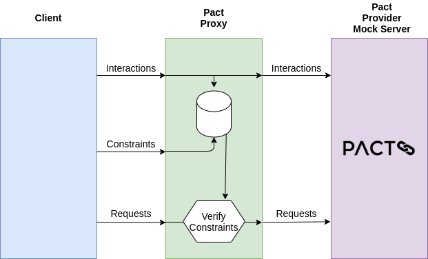

# Pact-Proxy

## What is it?
Pact-Proxy is a proxy that can inject additional behaviour into pact provider mocks without modifying the generated pacts files.

## Why do I need it?
Pact is great of defining and verifying contracts between services but there are often cases where you want to
use the mock server to verify requests that are made with a different set of values or are made a specific number of times
while keeping the contract between the consumer and the provider simple and loosely defined.
Pact doesn't support this very easily, the pact proxy can overlay additional functionality that is not supported
by pact without modifying the interaction definitions or the behaviour of the pact mock server in any way.

## How does it work?
The proxy intercepts http requests that would usually be sent to the pact mock server, this includes requests to 
register interactions and the actual interactions themselves. The proxy exposes additional endpoints that allow
additional constrains to be added to an interaction, these are evaluated by the proxy before the request is
forwarded onto the pact mock server.
After the request is returned from the pact mock server, modifiers can be applied. A modifier can modify HTTP status code
or body. This can be useful for testing server side errors or reusing same pacts without generating additional load
on the pact provider side.



## What types of constraint are supported?

### Value constraints
Constraints can be added to any part of the request, currently the only constraint type supported is one that exactly
matches the value of the request.

Constrains are attached to an interaction using the JSON path of a value within the interaction definition. For example
given the following interaction that matches any request to `/v1/users?username=.*`

```yaml 
{
  "description" : "example interaction",
  "request" : {
    "method" : "GET",
    "path" : "/v1/users",,
    "query" : {
      "username" : "any"
    },
    "matchingRules": {
      "query": {
        "username": { "matchers": [ {"match": "regex", "regex": ".*"] }
      }
    }
  }
}
```

A constraint can be added to make sure that the username matches a specific value by using the following values:

```
POST /interactions/constraints

interaction:       example interaction
path:              $.query.username
value:             John
```

With constraint added only requests where the username matches the value "John" are forwarded to the pact server all other
requests are rejected.

### Dynamic Value Constraints

Constraints can also be added that will enforce a value in a request matches the value from a previous request.
For example if we add another interaction like this:

```yaml 
{
  "description" : "example interaction 1",
  "request" : {
    "method" : "POST",
    "path" : "/v1/addresses"
    "body": {
        "username": "any",
        "street": "any",
        "postcode": "any"
    }
    "matchingRules": {
        "$.body.user": { "regex": ".*" },
        "$.body.street": { "regex": ".*" },
        "$.body.postcode": { "regex": ".*" },
    }
  }
}
```

A constraint can be added to make sure that the username matches with the value used in the previous interaction:

```
POST /interactions/constraints

interaction:       example interaction 1
path:              $.body.username
source             example interaction
format:            %s
value:             $.query.username
````

With this constraint added when a request is sent to `GET /v1/users?usernane=Jane` then a request to 
`/v1/addresses` must have a username in the body of `Jane` as well.

## Modifiers
Pact-proxy can register response modifiers for HTTP status code or response body with optional on `attempt` indicator.

An example HTTP status code modifier:
```
POST /interactions/modifiers

interaction:       example interaction 1
path:              $.status
value:             503
````

An example response body modifier:
```
POST /interactions/modifiers

interaction:       example interaction 1
path:              $.body.username
value:             jim.brown
````

An example response body modifier on second attempt:
```
POST /interactions/modifiers

interaction:       example interaction 1
path:              $.body.username
value:             jim.brown
attempt:           2
````


## What other operations are supported?

The pact proxy also supports waiting for interactions to be called a specified number of times.

```
/interactions/wait?interaction=example%20interaction&count=5 
```

The example above will wait until the `example interaction` is called 5 times. A call to `/interactions/wait` with no
parameters will wait for all interactions to be called at least once.

## Is there a go client?

Yes

`go get github.com/form3tech-oss/pact-proxy/pkg/pactproxy`